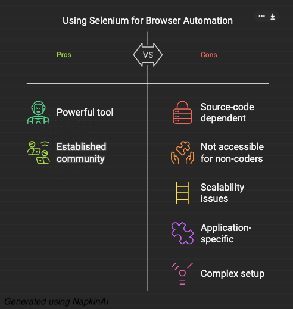

# LIAutomator
More human-like automation

To be specfic: Proof-of-concept AI agent to control my computer and logically traverse web UIs like humans in order to automate nontrivial tasks and workflows on web apps.

# Demo

#### Short-Form Demo (recommended)

#### Full-Length Realtime Raw Demo

<!-- 
<b> Note</b>
 -->
> [!NOTE]
> The Source Code is not currently Open Source. But if there seems to be interest, I can publicly release it.
> Make a Github Issue or reach out for any comments, questions, or requests: nnakkapa at umich dot edu

# Features
1. Works out-of-the-box!
2. Includes GUI to start/stop automation and show real-time metrics (like # of LLM requests)
3. It's TOTALLY FREE! $0 Cloud costs for AI APIs (must have TOGETHER API KEY)
4. No hardcoding of GUI element positions! So this application can run independent of the application window's size or location on your computer. See the FAQs for more info.
5. In-built Robustness: 
    * Error-handling and backtracking of states to ensure that automation will work given 3 tries. 
    * Can configure redundunacy option to increase number of Vision Models, reducing any possible hallucinations (or unnecssary creativity)
6. FAST! This application is multi-threaded. 
7. Audio updates regarding state and AI agent current action (only for MacOS currently)
8. Can be configured to include human input/directions in the automation process (using Whisper transcription of your voice)
# Features for Developers
7. Code is written following OOP principles, allowing for modularity and reuse of components to create new automations
8. Framework included to abstract away computer control functions like scrolling, clearing/inputting txt, etc. 
9. Logging enabled for easier debugging; automation metrics and configuration are collected/saved in a .csv file

# Future
1. Open source the src code if there seems to be interest!
2. Benchmark against Claude Computer Use and ChromeGPT 
3. Make it faster
4. Do Large Scale Experiments 
6. Maybe make a Docker?
7. Experiment with other models (perhaps finetuned models), better prompt engineering, better hyperparameter tuning
6. **Create a higher-level of abstraction or harness (aka set of functions with simple APIs) to allow AI to self-generate actions given an high-level task description. In this way, you don't need to preconfigure the workflow (the AI trys to learn the proper workflow).**
    * Has some overtones of Reinforcement Learning tbh

# Lessons Learned
1. Should have programmed everything in OOPs in the beginning and planned more
2. Will update more later

# FAQ
1. Why not just use Selenium since this is just browser automation? 
    * Good question! First, Selenium is source-code dependent automation. You need to read the underlying HTML of the webpage, understand how to grab the elements you want, and then code it up. Thus, Selenium is not really accessible for non-coders and even if you can code, it can be too "in-the-weeds".  Second, the whole purpose of websites, browsers, and GUIs is to help humans naturally interact with software. So, let's automate GUIs in the way they were meant to be used.
    Third, Selenium is not scalable. You can't really create high-level primitives and then ask AI to use those high level primitives to create an list of actions to execute a task. I mean, maybe you can, but what I mean is you want the possible GUI-based automation actions (read, scroll, find_click_button) to be as generalizable as possible (aka not application specific). This can then allow for a more wider variety of automation applications while still using the same GUI-based automation actions (platform-independent, or in this case, website-independent). *Overall, Selenium is Browser Automation while this AI Agent is Browser Automation on Steroids.* 

2. Why not just use an Linkedin API to read profile info and send connection requests. You should be able to do this with anti-bot backend mechanisms since you're not using a browser.
    * Please see the above question. But to answer breifly, there might be unnecssary problems: rate-limits, anti-bot detection mechanisms since you're not using a browser, perhaps too much time to reverse engineer their API, no GUI/visual confirmations, not scalable, not understandable/accesbile to non-programmers, etc. 

